# 🔄 Fluxos de Trabalho - Sistema Zyra

## 📋 Visão Geral

Este documento descreve os principais fluxos de trabalho do sistema Zyra, desde o cadastro de equipamentos até o monitoramento e alertas.

## 🏗️ 1. Fluxo de Cadastro de Equipamento

### 1.1 Início do Processo
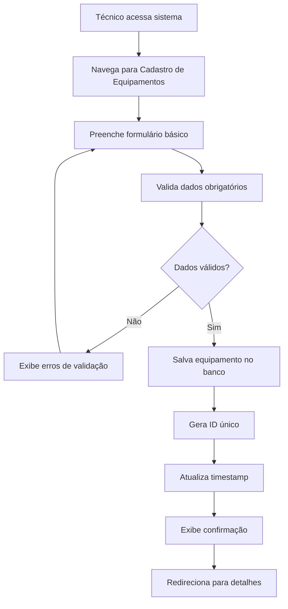

### 1.2 Validações Obrigatórias
- **Nome**: Único no sistema
- **IP Privado**: Único na rede
- **Serial**: Único por fabricante
- **Coordenadas**: Latitude/longitude válidas
- **Data de Aquisição**: Não pode ser futura

### 1.3 Dados Opcionais
- IP Público
- Fotos do equipamento
- Observações técnicas
- Porta de acesso específica

### 1.4 Pós-Cadastro
1. **Configuração de Monitoramento**: Ativar ping automático
2. **Upload de Fotos**: Adicionar imagens do equipamento
3. **Definição de Links**: Conectar com outros equipamentos
4. **Configuração de Alertas**: Definir limites de monitoramento

## 🔗 2. Fluxo de Gestão de Topologia

### 2.1 Visualização da Topologia
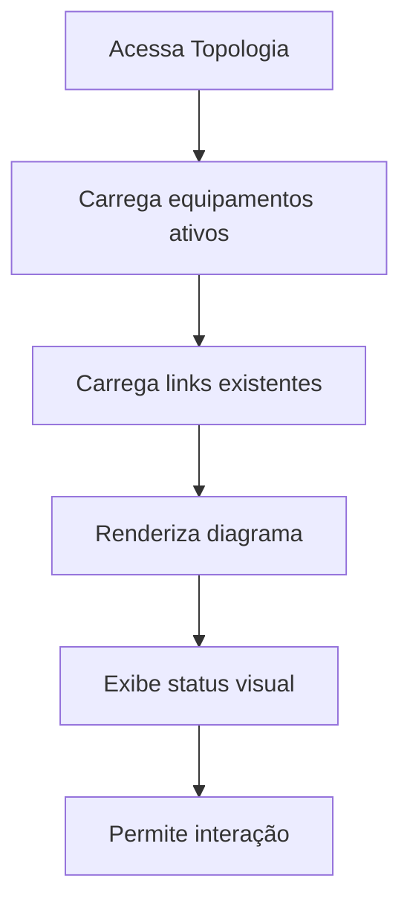

### 2.2 Edição de Conexões
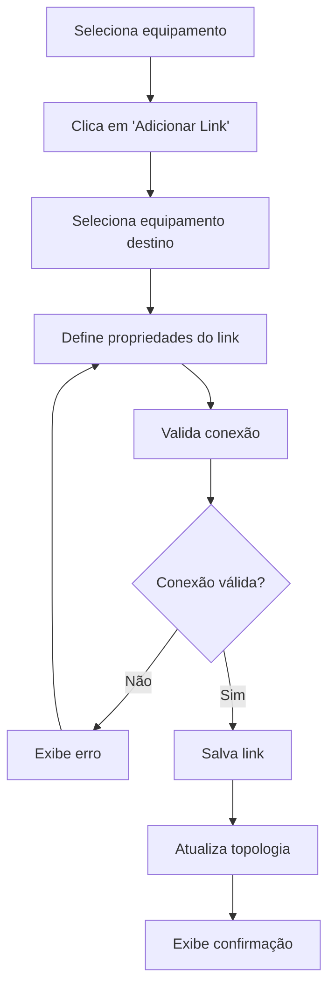

### 2.3 Validações de Topologia
- **Conexão Dupla**: Não permitir loops desnecessários
- **Capacidade**: Verificar se equipamentos suportam a conexão
- **Status**: Apenas equipamentos ativos podem ser conectados
- **Tipo de Link**: Validar compatibilidade entre equipamentos

## 📊 3. Fluxo de Monitoramento

### 3.1 Coleta de Métricas
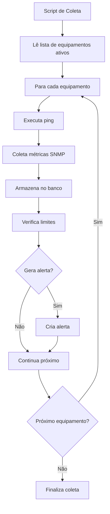

### 3.2 Processamento de Alertas
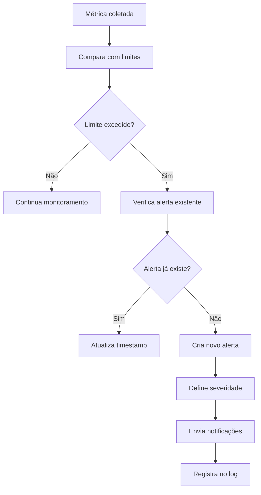

### 3.3 Tipos de Coleta
- **Ping (ICMP)**: A cada 5 minutos
- **SNMP**: A cada 15 minutos
- **SSH/API**: A cada 30 minutos
- **Backup**: Verificação diária

## 🚨 4. Fluxo de Alertas

### 4.1 Geração de Alertas
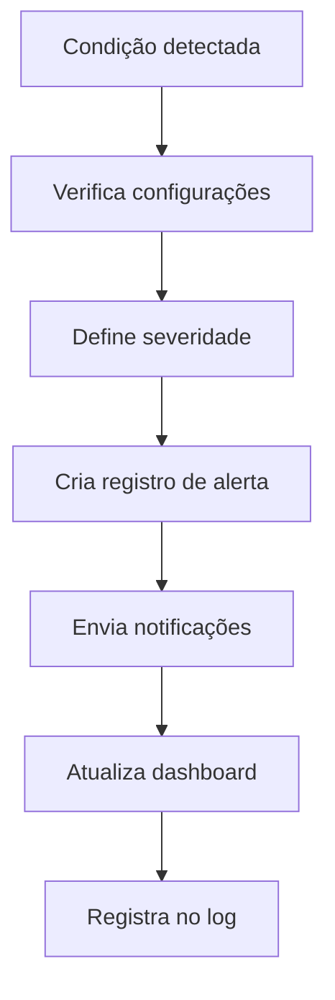

### 4.2 Tipos de Alertas
- **Ping Alto**: Latência acima do limite
- **Equipamento Offline**: Sem resposta ao ping
- **CPU Alta**: Utilização acima de 80%
- **Memória Baixa**: Disponível abaixo de 15%
- **Temperatura Alta**: Acima do limite seguro
- **Backup Pendente**: Sem backup há X dias

### 4.3 Resolução de Alertas
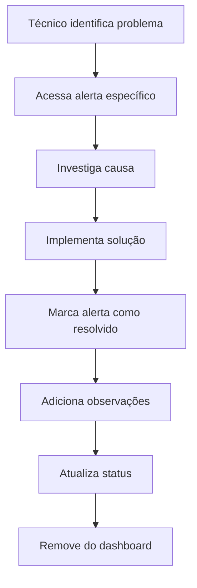

## 💾 5. Fluxo de Gestão de Backups

### 5.1 Upload de Backup
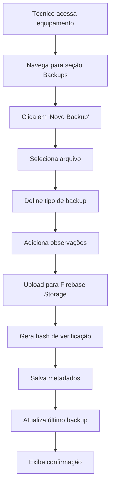

### 5.2 Controle de Pendências
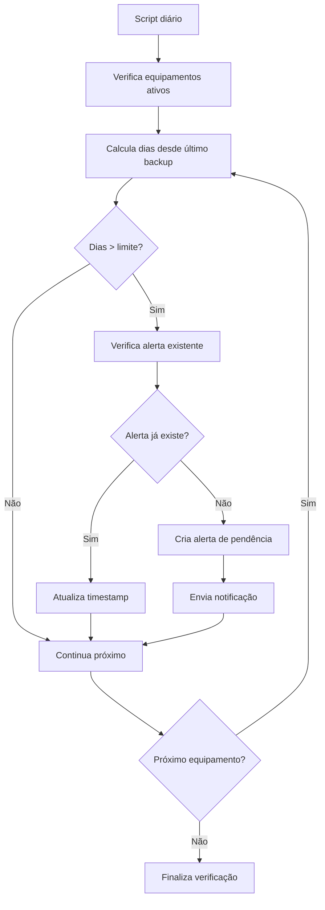

### 5.3 Download de Backup
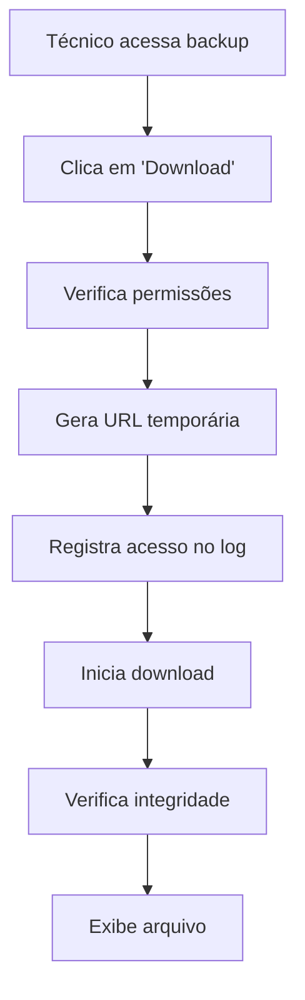

## 📈 6. Fluxo do Dashboard

### 6.1 Carregamento do Dashboard
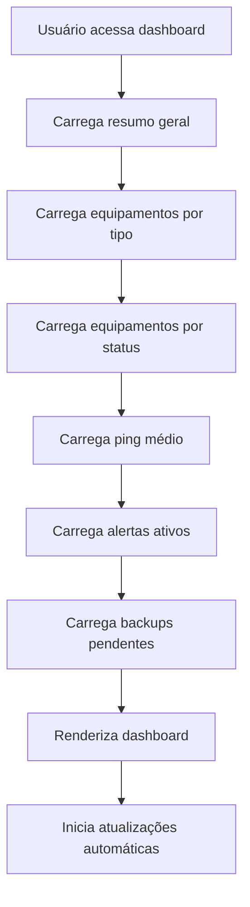

### 6.2 Atualizações em Tempo Real
- **Ping**: Atualizado a cada 5 minutos
- **Alertas**: Atualizado imediatamente
- **Status**: Atualizado a cada 15 minutos
- **Backups**: Atualizado diariamente

## 🔍 7. Fluxo de Busca e Filtros

### 7.1 Busca Global
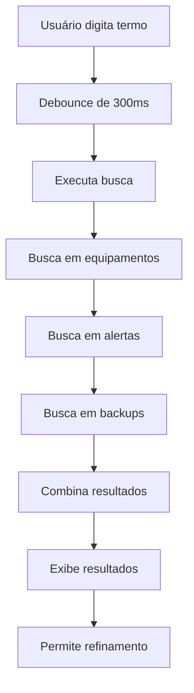

### 7.2 Aplicação de Filtros
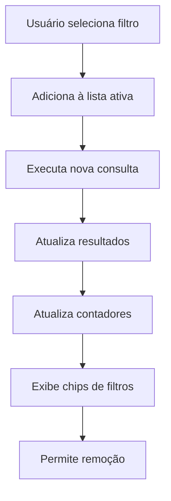

### 7.3 Filtros Disponíveis
- **Tipo de Equipamento**: Switch, Roteador, OLT, etc.
- **Cidade**: Localização geográfica
- **Status**: Ativo, Manutenção, Reserva, etc.
- **Fabricante**: Mikrotik, Huawei, Ubiquiti, etc.
- **Data de Aquisição**: Período específico
- **Modo de Acesso**: SSH, Web, Telnet, etc.

## ⚙️ 8. Fluxo de Configurações

### 8.1 Acesso às Configurações
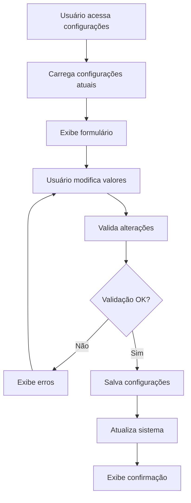

### 8.2 Configurações Disponíveis
- **Monitoramento**: Tempo de ping, limites de latência
- **Alertas**: Limites de CPU, memória, temperatura
- **Backups**: Dias sem backup, tipos permitidos
- **Notificações**: Email, Telegram, WhatsApp
- **Sistema**: Timeout, tentativas, logs

## 📊 9. Fluxo de Relatórios

### 9.1 Geração de Relatório
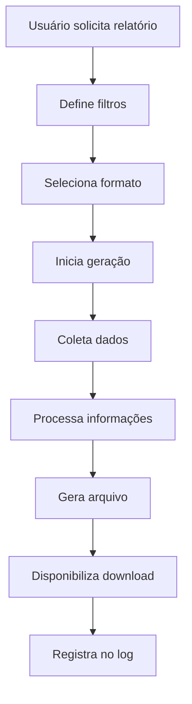

### 9.2 Tipos de Relatórios
- **Inventário**: Lista completa de equipamentos
- **Alertas**: Histórico de alertas por período
- **Backups**: Status de backups por equipamento
- **Performance**: Métricas de monitoramento
- **Topologia**: Mapa da rede atual

## 🔄 10. Fluxo de Sincronização

### 10.1 Sincronização de Dados
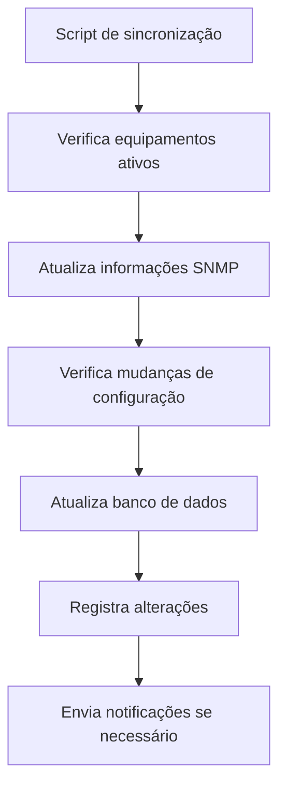

### 10.2 Frequência de Sincronização
- **Informações básicas**: Diariamente
- **Configurações**: Semanalmente
- **Firmware**: Mensalmente
- **Inventário**: Conforme necessário

## 🚀 11. Fluxo de Deploy

### 11.1 Deploy do Sistema
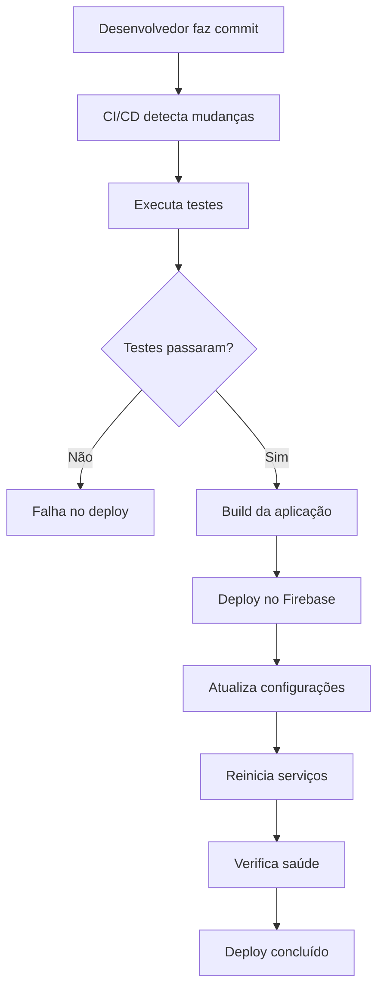

### 11.2 Rollback
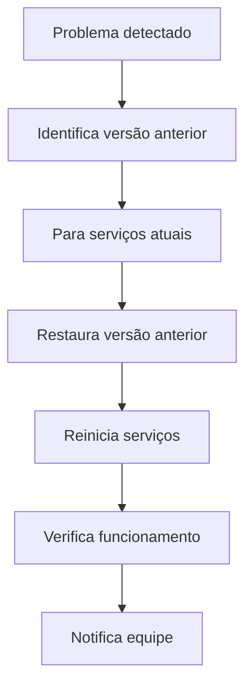

## 📱 12. Fluxo de Notificações

### 12.1 Envio de Notificações
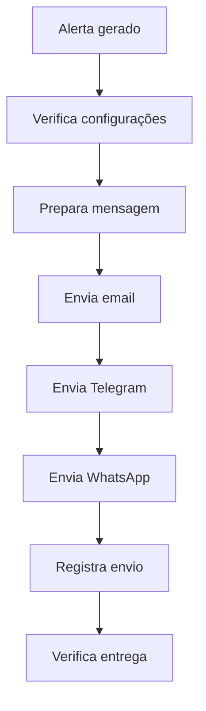

### 12.2 Tipos de Notificação
- **Email**: Para alertas críticos
- **Telegram**: Para alertas médios e altos
- **WhatsApp**: Para alertas críticos
- **SMS**: Para alertas críticos (futuro)

## 🔐 13. Fluxo de Autenticação

### 13.1 Login do Usuário
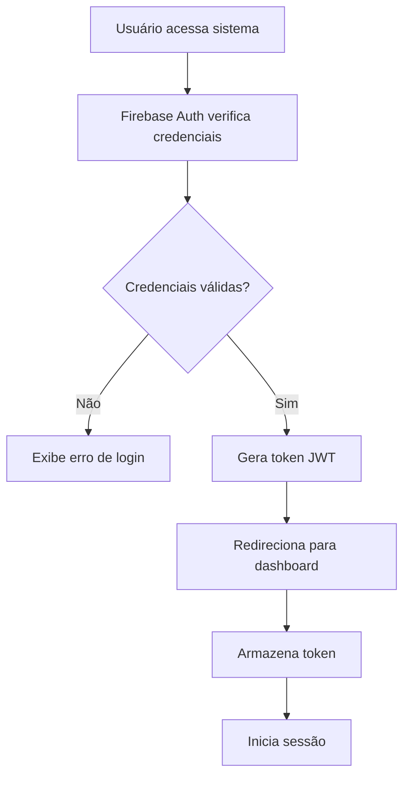

### 13.2 Renovação de Token
```mermaid
graph TD
    A[Token próximo do vencimento] --> B[Firebase renova token]
    B --> C[Atualiza armazenamento]
    C --> D[Continua sessão]
```

## 📋 14. Fluxo de Auditoria

### 14.1 Registro de Alterações
```mermaid
graph TD
    A[Usuário faz alteração] --> B[Sistema captura dados]
    B --> C[Registra timestamp]
    C --> D[Registra usuário]
    D --> E[Registra alteração]
    E --> F[Salva no log de auditoria]
    F --> G[Mantém histórico]
```

### 14.2 Consulta de Auditoria
```mermaid
graph TD
    A[Usuário solicita auditoria] --> B[Define filtros]
    B --> C[Consulta logs]
    C --> D[Processa resultados]
    D --> E[Exibe histórico]
    E --> F[Permite exportação]
```

---

Estes fluxos de trabalho garantem que o sistema Zyra funcione de forma eficiente e confiável, proporcionando uma experiência consistente para os usuários da G2 Telecom.
